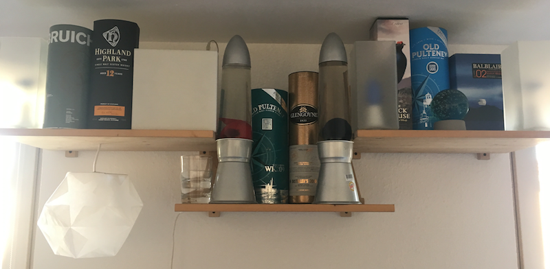
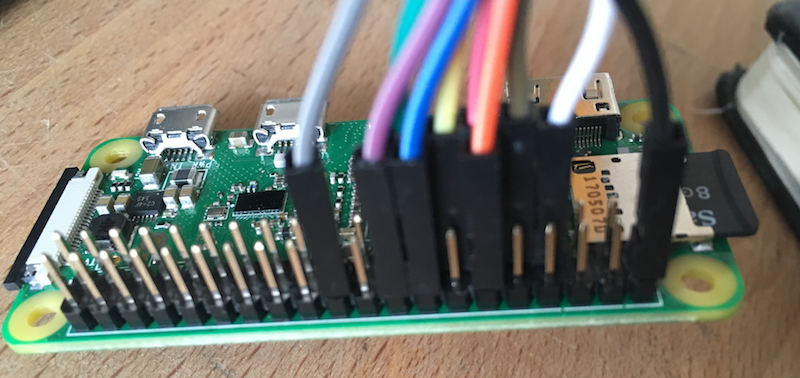
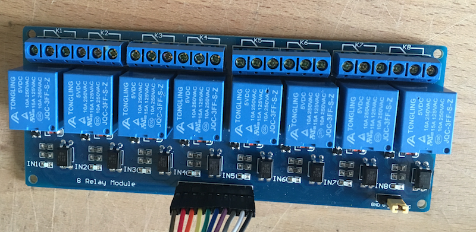
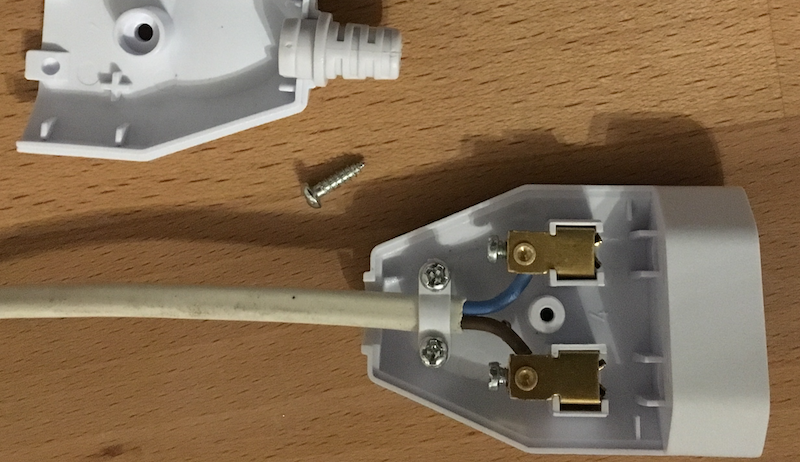
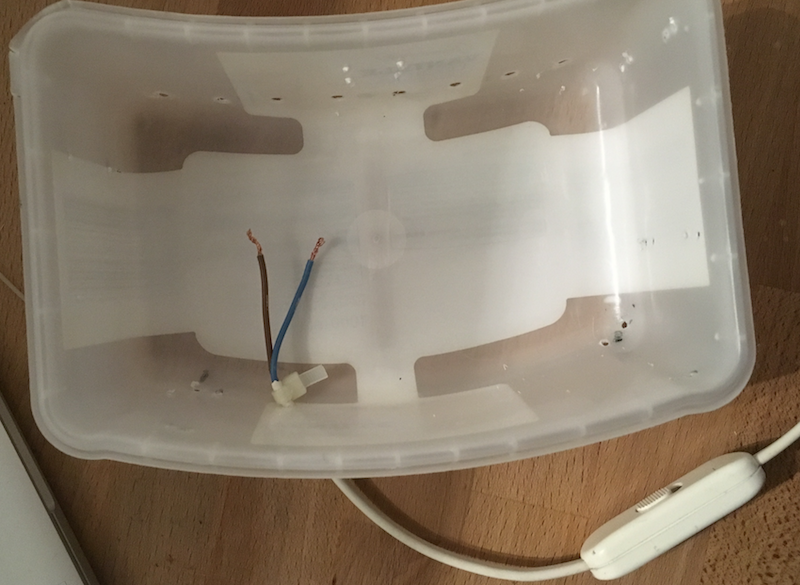
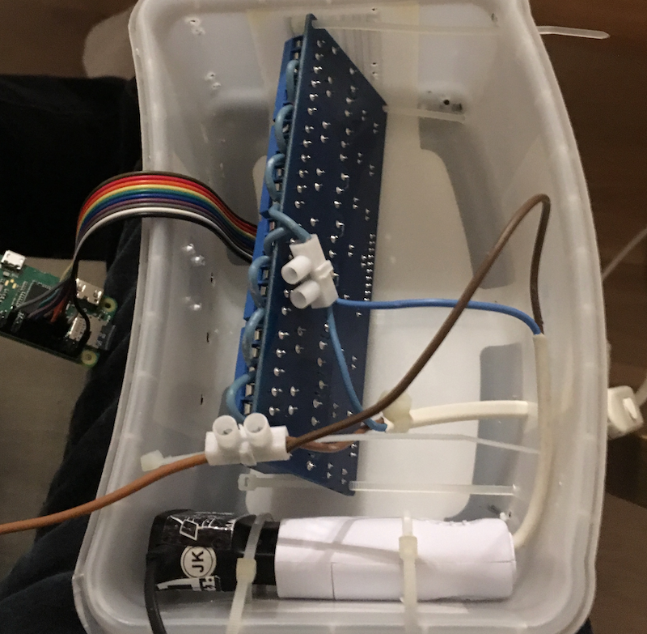
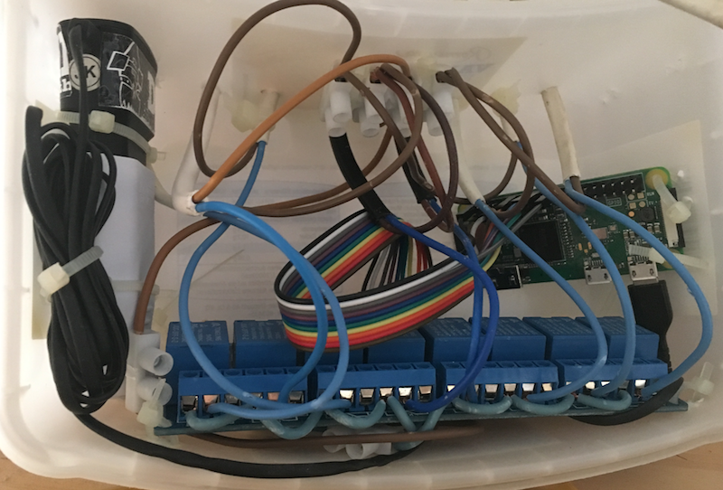
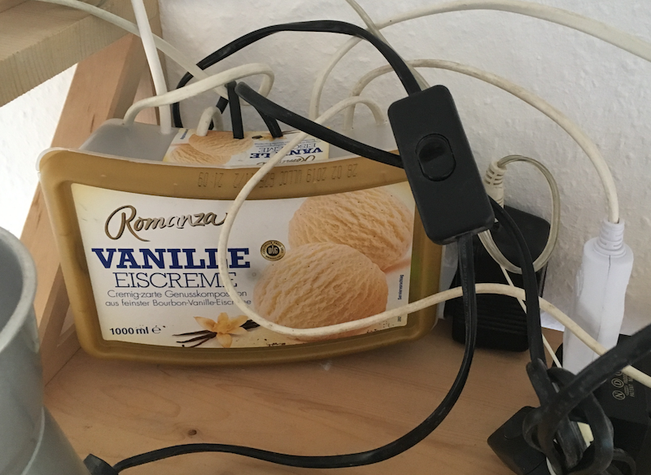
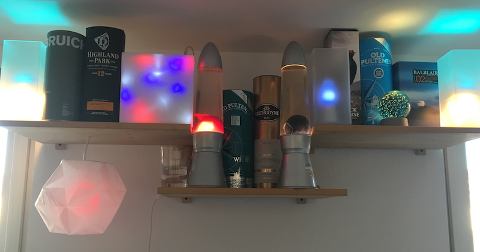

# relayPi

This lets me control my lamp with my wifi without an eval cloud.


## Hardware

Raspberry Pi Zero with GPIO-pins



Relay-board with jumper-cable



Usb-charger and a bachmann-coupling



A Case


## Sd-card image
I downloaded the the [RASPBIAN STRETCH LITE](https://www.raspberrypi.org/downloads/raspbian/)
and burned it to an sd-card using [etcher](https://etcher.io/)

## Headless, ssh, wifi and gpio
unless i did not had the adapters for my pi zero i booted the sd-card in a Pi3 with connected
monitor and keyboard,

### Set up wifi
On the Pi I edited the wpa_supplicant.conf
```sudo nano /etc/wpa_supplicant/wpa_supplicant.conf```

and type in my wifi-settings in the end of the file
```
network={
    ssid="Your WiFi name"
    psk="Your WiFi password"
}
```

### Ssh
On the Pi I
```sudo raspi-config``` and changed password,hostname (to relaypi) and activated ssh (Interfacing Options -> SSH) 
I created the .ssh directory
```
install -d -m 700 ~/.ssh
```

Now I was able to connect to the pi remotely. And to make it convenient I copied my ssh key on the pi
```cat ~/.ssh/id_rsa.pub | ssh pi@relaypi 'cat >> .ssh/authorized_keys'```

now accessing the pi is easy ```ssh pi@relaypi``` 

### GPIO and Java
the backend-server is using wiringpi so I installed it on the pi
```
sudo apt-get install wiringpi
```

install java
```
sudo apt-get update && sudo apt-get install oracle-java8-jdk
```
create a directory for the server
```mkdir ~/relay-pi-server```

## Run the server
```
./deploy.sh
```
Now I was able to control the [the relays](http://relaypi:8080) in my browser

## Auto start the server when the pi boots
open
```
sudo nano /etc/rc.local
```
and add
```
printf "autostart relaypi"
java -jar /home/pi/relay-pi-server/relay-pi.jar >> /home/pi/relay-pi-server/relay-pi.log &
```
to it

## Construction

I drilled some holes,



mounted the components with cable straps,



connected everything



and closed the box



## Finally

